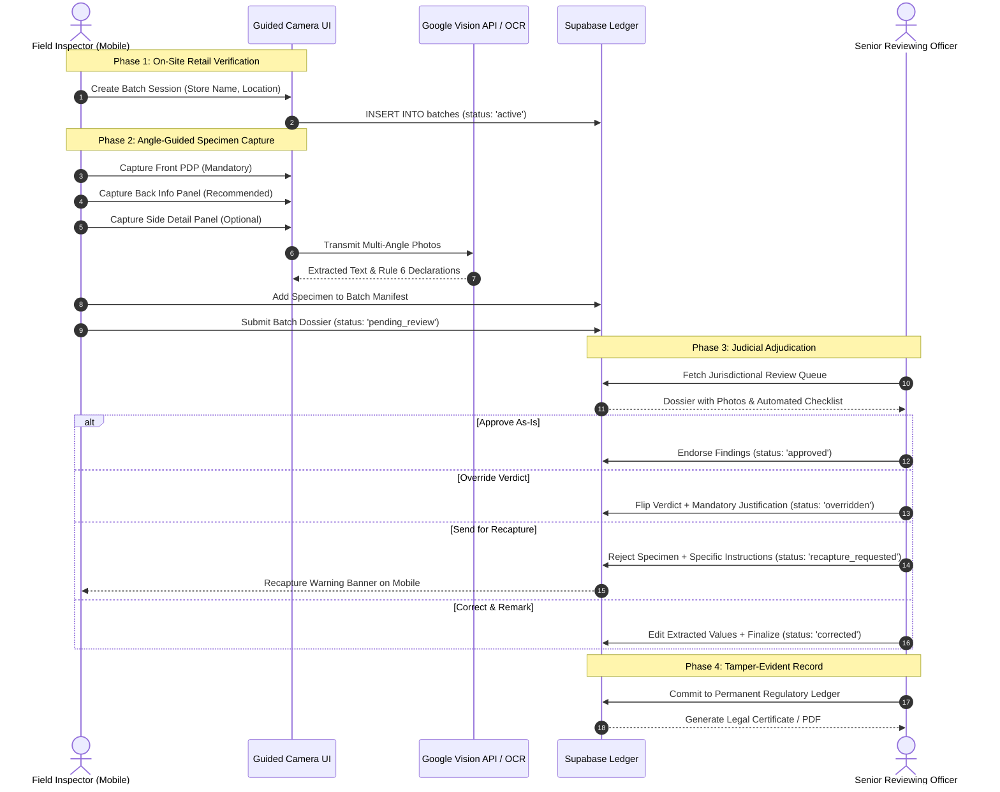
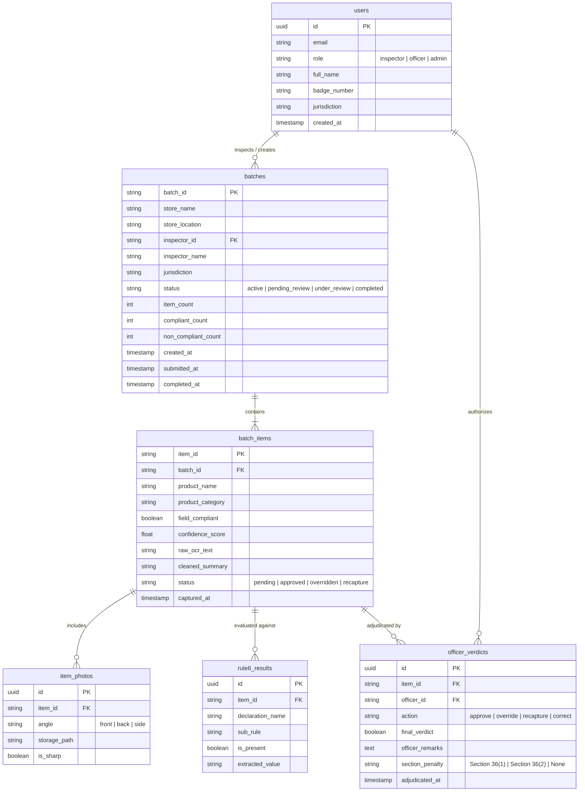

# LabelLens: System Architecture & Data Flow

This document details the multi-tiered architecture, regulatory enforcement workflow, entity relationships, and access control model governing LabelLens.

---

## 🏛️ High-Level System Workflow

The end-to-end regulatory lifecycle progresses through four distinct phases:

---

## 📊 Data Model & Entity Relationships

The relational data model in Supabase (PostgreSQL) connects field enforcement sessions with judicial determinations:

---

## 🔐 Authentication & Role-Based Access Control (RBAC)

LabelLens strictly separates field enforcement responsibilities from judicial oversight:

### Role Matrix

| Capability / Route | Field Inspector | Senior Reviewing Officer | System Administrator |
| :--- | :---: | :---: | :---: |
| **Landing & Role Select (`/login`)** | Access | Access | Access |
| **Mobile Inspector Portal (`/inspector`)** | Full Access | Read-Only View | Admin View |
| **Camera Capture Engine (`camera.js`)** | Full Access | Disabled | Disabled |
| **Batch Initiation & Manifest Edit** | Full Access | Restricted | Admin Override |
| **Reviewing Officer Workbench (`/officer`)** | Access Denied | Full Access | Full Access |
| **Verdict Override & Adjudication** | Restricted | Full Access | Audit Only |
| **Recapture Request Issuance** | Restricted | Full Access | Restricted |
| **Jurisdictional User Management** | Access Denied | Access Denied | Full Access |

### Enforcement Mechanisms
1. **Client-Side Route Guard (`frontend/auth.js`)**:
   - Inspects `LabelLensAuth.getAuthSession()`.
   - Bounces unauthenticated visitors to `/login`.
   - Prevents an authenticated Field Inspector from navigating to `/officer`, displaying a departmental access restriction notice.
2. **Supabase Row Level Security (RLS)**:
   - Inspectors can only `INSERT` and `UPDATE` batches where `inspector_id = auth.uid()`.
   - Reviewing officers possess `SELECT` and `UPDATE` permissions on batches matching their assigned `jurisdiction`.
   - Immutable audit log triggers prevent post-adjudication alterations of finalized records.

---

## 🔗 Related Documentation

- Technology Choices: [docs/TECH_STACK.md](TECH_STACK.md)
- Local Setup & Migration Instructions: [docs/SETUP.md](SETUP.md)
- Outstanding Tasks & Roadmap: [docs/TODO.md](TODO.md)
- Local Dev Credentials: [CREDENTIALS.md](../CREDENTIALS.md)
