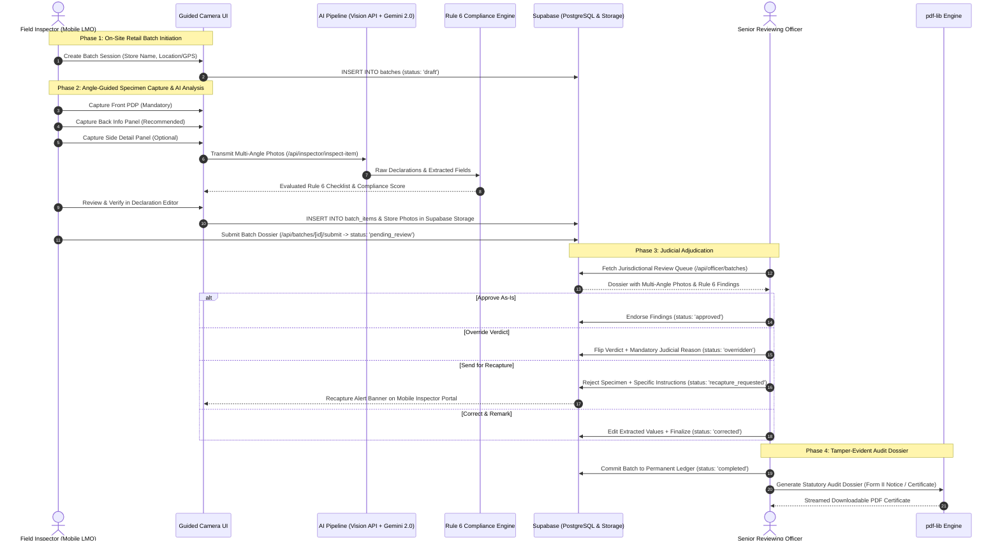
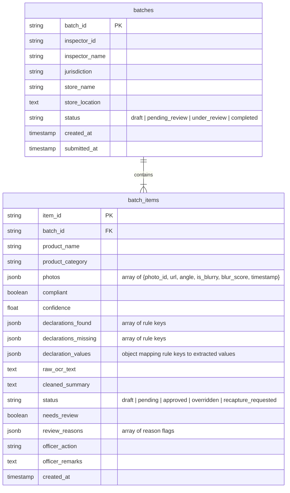

# LabelLens: System Architecture & Data Flow

This document details the multi-tiered architecture, regulatory enforcement workflow, entity relationships, and access control model governing LabelLens.

---

## 🏛️ High-Level System Workflow

The end-to-end regulatory lifecycle progresses through four distinct phases:

---

## 📊 Data Model & Entity Relationships

The relational data model in Supabase (PostgreSQL) connects field enforcement sessions with judicial determinations:

---

## 🔐 Authentication & Role-Based Access Control (RBAC)

LabelLens strictly separates field enforcement responsibilities from judicial oversight:

### Role Matrix

| Capability / Route | Field Inspector (`inspector`) | Senior Reviewing Officer (`officer`) | System Administrator (`admin`) |
| :--- | :---: | :---: | :---: |
| **Landing & Role Select (`/login.html`)** | Access | Access | Access |
| **Mobile Inspector Portal (`/inspector.html`)** | Full Access | Read-Only View | Admin View |
| **Camera Capture Engine (`camera.js`)** | Full Access | Disabled | Disabled |
| **Batch Initiation & Manifest Edit** | Full Access | Restricted | Admin Override |
| **Reviewing Officer Workbench (`/officer.html`)** | Access Denied | Full Access | Full Access |
| **Verdict Override & Adjudication** | Restricted | Full Access | Audit Only |
| **Recapture Request Issuance** | Restricted | Full Access | Restricted |
| **Statutory PDF Generation (`pdf-lib`)** | View Only | Generate & Export | Generate & Audit |
| **Jurisdictional User Management** | Access Denied | Access Denied | Full Access |

### Enforcement Mechanisms
1. **Client-Side Route Guard (`frontend/auth.js`)**:
   - Inspects active session credentials and assigned roles.
   - Restricts unauthenticated visitors to `/login.html`.
   - Prevents an authenticated Field Inspector from accessing `/officer.html`, redirecting with a jurisdictional notice.
2. **Serverless API Route Validation (`app/api/`)**:
   - API endpoints enforce role checks prior to executing transactional writes or status transitions.
3. **Supabase Storage Isolation**:
   - Multi-angle photos are stored under structured paths (`uploads/`) within the `specimen-photos` bucket, linked immutably to item IDs.

---

## 🔗 Related Documentation

- Technology Choices: [docs/TECH_STACK.md](TECH_STACK.md)
- Local Setup & Migration Instructions: [docs/SETUP.md](SETUP.md)
- Legal & Regulatory Compliance Guide: [docs/LEGAL_COMPLIANCE.md](LEGAL_COMPLIANCE.md)
- Quick Start & Demo Accounts: [README.md#demo-credentials--test-roles](../README.md#-demo-credentials--test-roles)
